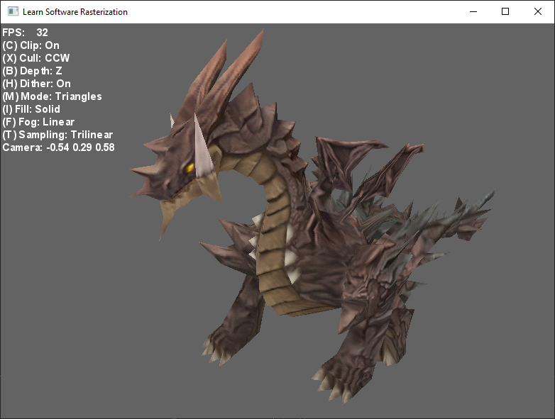

# Learn Software Rasterization

## Description
A simple single-threaded 3d software rasterizer developed for learning purposes.

## Features
1. Rasterization:
	1. Points
	2. Lines
	3. Triangles
2. Geometry:
	1. Clipping
	2. Culling
3. Effects:
	1. Fog
	2. Dithering
6. Rasterization modes:
	1. Points
	2. Wireframe
	3. Solid triangle rasterization
7. Depth buffers:
	1. Z buffer
	2. W buffer
8. Textures:
	1. Single-layer
	2. Multi-layer (mipmap)
10. Texture sampling:
	1. Nearest
	2. Bilinear
	3. Trilinear
